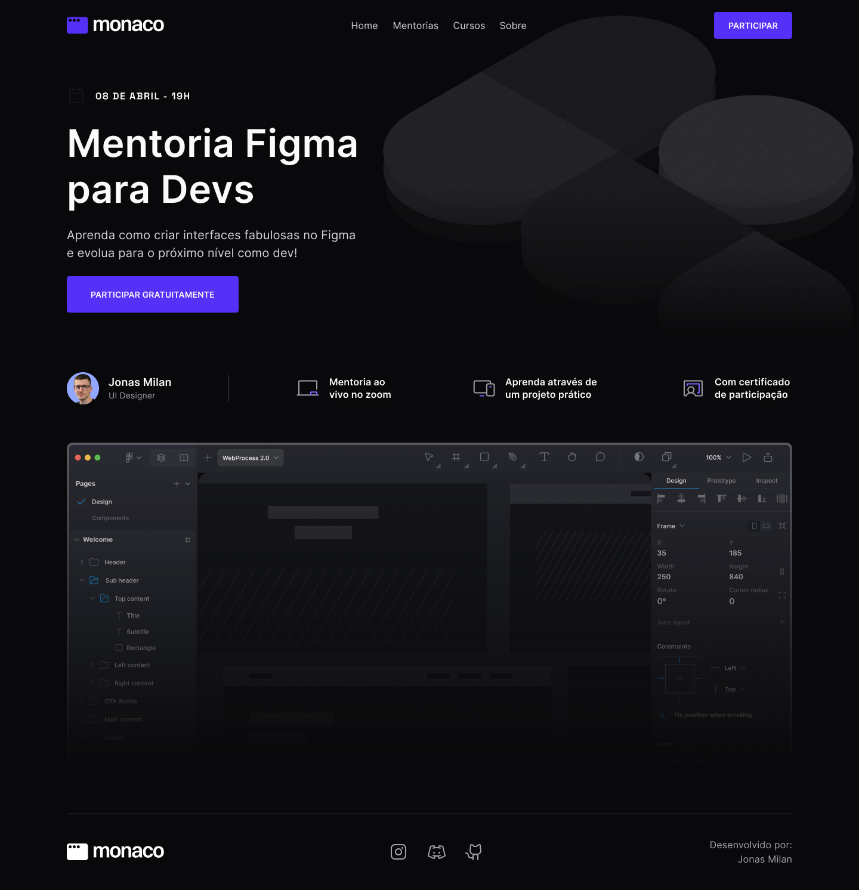

Status: Completo 🚀

## Figma para Devs
Neste projeto, foi realizado o desafio de programar uma landing page que foi criada durante a mentoria de Figma para Devs, replicando exatamente o que foi apresentado durante a mentoria.

## Funcionalidades:
 * Landing Page
<hr/>
<br/>

<center>
 <div> 
<br/>
</center>
<br/>
<hr/>

## Tecnologias Utilizadas:

 * Next
 * TailwindCSS
 * Phosphor Icons
 * prettier plugin tailwindcss
 * typescript
 * tailwind variants

<hr/>

 ## Link do projeto no ar: <a href="https://landing-page-figma-for-devs.vercel.app/">Acessar</a>
 
## Instalação
  * Faça um clone do repositório do projeto no GitHub.
  * Navegue até o diretório do projeto.
  * Execute o seguinte comando para instalar as dependências:

```
$ pnpm install
```

## Running the project
```
$ pnpm run dev
```
